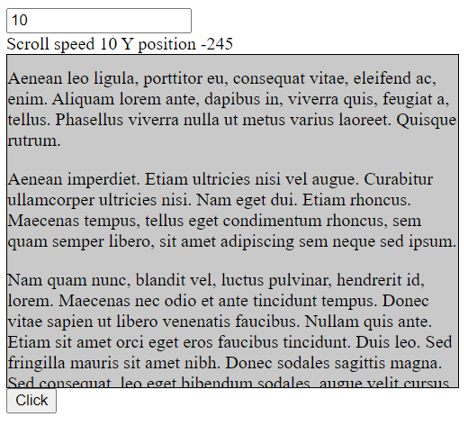

# Element-Scrolling-Content-Code-Snippet
Apply JavaScript to select elements and event triggers.Use JavaScript to move element contents, track position of elements and mouse. Update scroll speed.

# Image

